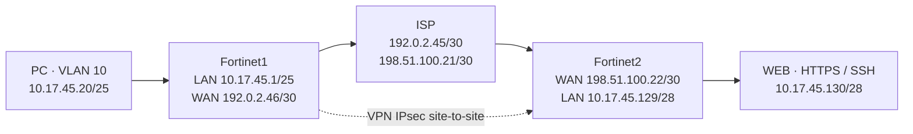

# Práctica 2 — VPN Site-to-Site · INFRA1

Laboratorio de Seguridad de Redes en PNETLab para comunicar una estación de usuario con un servidor mediante una VPN IPsec entre dos FortiGate. El acceso al servidor debe funcionar con el túnel activo y fallar cuando se deshabilita.

Este repositorio reúne la documentación disponible y sus archivos de apoyo. Los resultados corresponden a las pruebas registradas el 1 y 2 de octubre de 2026; no representan una nueva validación de los equipos.

> **Estado pendiente de cierre:** la última revisión documentó conectividad intermitente el 2 de octubre. Faltan resolver esa intermitencia y completar las capturas y el video finales. Las pruebas satisfactorias anteriores se conservan como evidencia histórica.

## Objetivo y requisitos

- Dos FortiGate con configuración y demostración por GUI.
- VPN site-to-site, enlaces WAN y un ISP simulado.
- Usuario en VLAN 10, red /25 y direccionamiento por DHCP.
- Servidor web HTTPS en una red /28.
- Demostración de conectividad con VPN activa, caída al desactivarla y recuperación posterior.
- Traceroute hacia el servidor y documentación de NAT.

La [consigna original](docs/consigna.md) no precisa la aplicación final de NAT. La publicación de HTTPS por WAN se deshabilitó para evitar acceso alternativo al servidor fuera de la VPN. Las direcciones WAN pertenecen a rangos de documentación usados para simular Internet.

## Topología

La PC no utiliza un cliente VPN de acceso remoto. Los túneles se denominan `S2S-CLIENTE` y `S2S-SERVIDOR`.

| Equipo / interfaz | Dirección | Función |
| --- | --- | --- |
| PC · eth1.10 | 10.17.45.20/25 por DHCP | Usuario en VLAN 10 |
| Fortinet1 · VLAN10-USUARIOS | 10.17.45.1/25 | Gateway y DHCP |
| Fortinet1 · port2 | 192.0.2.46/30 | WAN del cliente |
| ISP · eth1 | 192.0.2.45/30 | Enlace a Fortinet1 |
| ISP · eth2 | 198.51.100.21/30 | Enlace a Fortinet2 |
| Fortinet2 · port2 | 198.51.100.22/30 | WAN del servidor |
| Fortinet2 · port1 | 10.17.45.129/28 | Gateway del servidor |
| WEB · eth1 | 10.17.45.130/28 | Servidor HTTPS y SSH |

Red de usuarios: `10.17.45.0/25`. Red del servidor: `10.17.45.128/28`. El servidor dispone de una ruta de retorno a usuarios por `10.17.45.129`; conserva una red de administración separada.

## Resultados documentados

| Comprobación | Resultado registrado |
| --- | --- |
| VLAN 10 y DHCP | PC con 10.17.45.20/25, gateway y DHCP 10.17.45.1 |
| HTTPS privado con VPN | HTTP 200 y página «Web Server is running» |
| SSH privado con VPN | Acceso interactivo confirmado por el usuario; banner en pruebas automáticas |
| Tráfico cifrado | ESP bidireccional observado en el ISP |
| VPN deshabilitada | Conexiones nuevas de HTTPS y SSH privados fallaron |
| Reactivación del túnel | HTTPS 200 y banner SSH recuperados |
| HTTPS por WAN | Sin respuesta tras deshabilitar las políticas de publicación |
| Traceroute UDP | 10.17.45.1 → 10.17.45.129 → 10.17.45.130 |
| Reinicio de PC, WEB e ISP | Recuperación automática de red y servicios en los mismos contenedores |
| Estabilidad del 2 de octubre | Pendiente: se observaron fallos intermitentes |

Las solicitudes HTTPS con `curl -k` comprueban respuesta del servicio, pero no la confianza del certificado. Las políticas VPN documentadas permiten `ALL`; no se presentan como limitadas a HTTPS y SSH. El reinicio del host PNETLab y de los FortiGate, así como la recreación de contenedores, no están validados.

## Documentación

| Archivo | Contenido |
| --- | --- |
| [Consigna](docs/consigna.md) | Requisitos aportados para la práctica |
| [Diseño](docs/diseno.md) | Direccionamiento, accesos administrativos y comportamiento esperado |
| [Pruebas y entregables](docs/pruebas-y-entregables.md) | Resultados, limitaciones y secuencia de demostración |
| [Persistencia](docs/persistencia.md) | Arranque, recuperación y alcance del reinicio probado |
| [Capturas finales](docs/capturas-finales.md) | Lista de evidencias gráficas pendientes |
| [Inventario PNETLab](docs/inventario-pnetlab.md) | Consulta histórica del 30 de septiembre, anterior al montaje final |
| [Registro de reinicio](evidencias/reinicio-20261001.txt) | Salida registrada el 1 de octubre de 2026 |
| [Scripts de apoyo](scripts/README.md) | Rutinas referenciadas por la documentación |

Los documentos conservan notas históricas: el diseño todavía menciona deshabilitar las políticas de publicación como pendiente; el registro posterior de pruebas indica que el usuario lo completó y que se verificó la falta de acceso WAN. Para el estado más reciente, consultar **Pruebas y entregables**.

## Demostración pendiente

1. Resolver la intermitencia revisando Forward Traffic y Phase 2 durante el fallo.
2. Mostrar por GUI el direccionamiento, DHCP, VLAN 10, túneles y políticas.
3. Con VPN activa, abrir `https://10.17.45.130` e iniciar SSH al mismo destino.
4. Deshabilitar administrativamente `S2S-CLIENTE` por GUI y comprobar que conexiones nuevas de HTTPS y SSH fallan. `Bring Down` puede permitir renegociación posterior.
5. Reactivar el túnel, demostrar recuperación y dejarlo habilitado.
6. Capturar el traceroute y guardar imágenes y video sin contraseñas ni claves.

El repositorio contiene documentación y scripts auxiliares; no incluye imágenes de máquinas virtuales, discos ni una exportación completa restaurable del laboratorio.
