# Evidencias gráficas — VPN INFRA1

Selección de 12 capturas originales aportadas por el usuario. Se copiaron sin alterar su contenido y se renombraron para facilitar la lectura. Las fechas indicadas proceden del nombre de cada archivo, no del reloj de FortiGate, que muestra un aviso de desincronización en varias imágenes.

Las imágenes documentan distintas etapas: las primeras usan `S2S-CLIENTE` / `S2S-SERVIDOR`; las posteriores muestran `VPN-S2S`. También cambia la asignación visible de interfaces del lado servidor. No se deben interpretar como una única configuración tomada en el mismo momento ni como una nueva prueba de estabilidad.

## 1. Esquema de topología

Dos firewalls conectan el usuario y el servidor a través de un ISP, con una VPN entre ambos. Es un esquema conceptual; no es una captura de los nodos en ejecución.

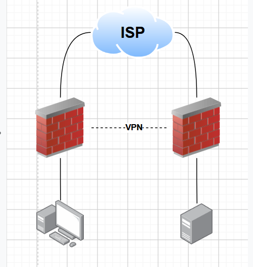

Origen: `Screenshot 2026-10-02 113244.png`.

## 2. VLAN 10 y DHCP del cliente

Interfaz `VLAN10-USUARIOS` sobre `port1`, VLAN ID 10, dirección `10.17.45.1/25` y DHCP habilitado con rango `10.17.45.20–10.17.45.120`. El gateway se toma de la interfaz. Esta captura muestra la configuración del servidor DHCP, no una concesión recibida por la PC.

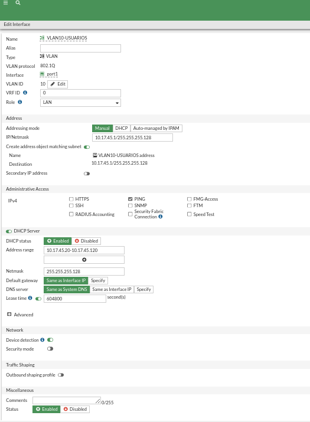

Origen: `Screenshot 2026-10-01 162424.png`.

## 3. WAN del FortiGate cliente

`WAN-ISP (port2)` con `192.0.2.46/30`, correspondiente al enlace del cliente con el ISP en el diseño inicial.

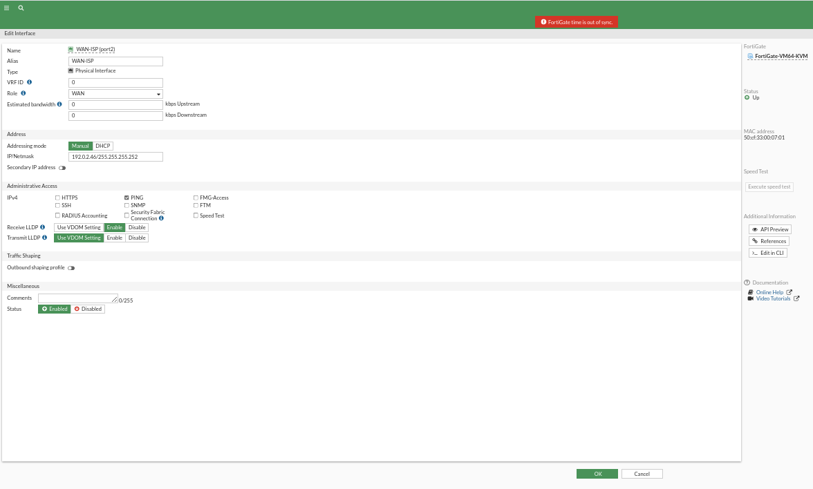

Origen: `Screenshot 2026-10-01 163902.png`.

## 4. LAN del FortiGate servidor

`port1` con `10.17.45.129/28`, gateway de la red del servidor en el montaje del 1 de octubre.

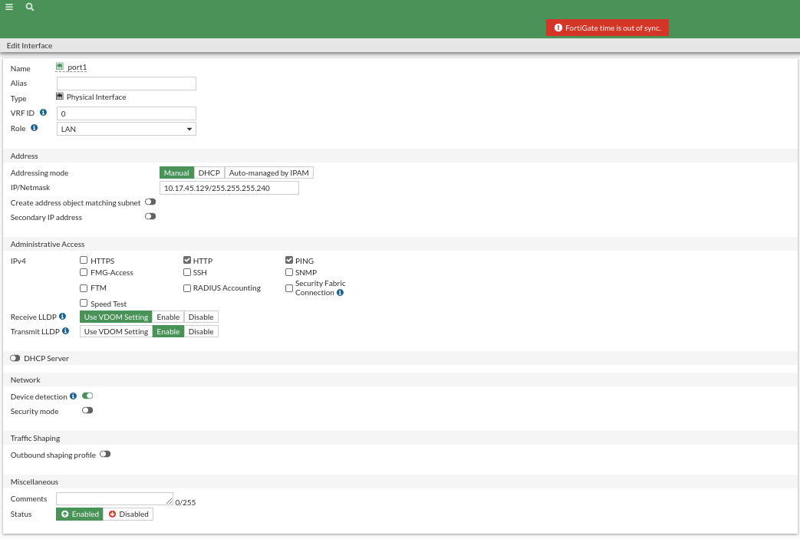

Origen: `Screenshot 2026-10-01 163620.png`.

## 5. WAN del FortiGate servidor

`WAN-ISP (port2)` con `198.51.100.22/30` en el montaje del 1 de octubre.

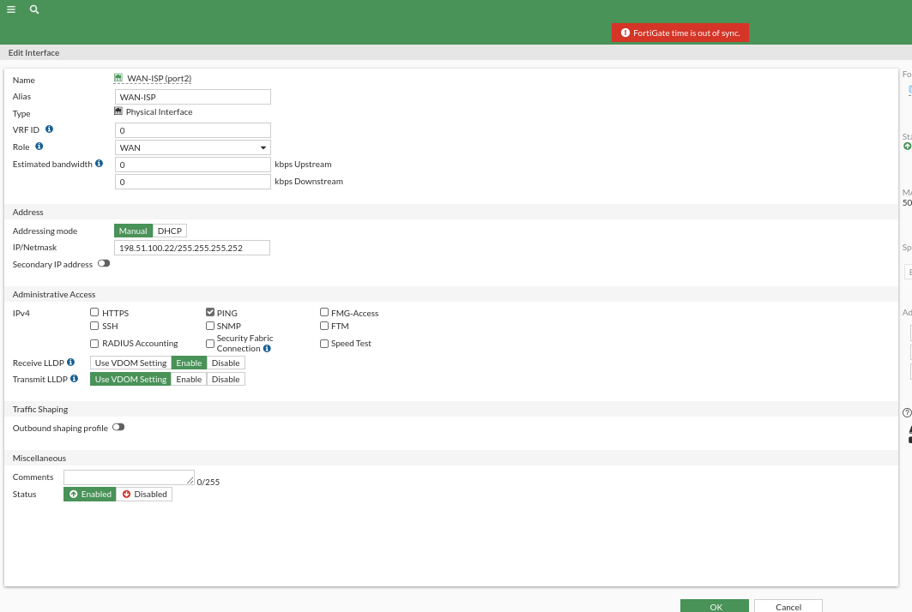

Origen: `Screenshot 2026-10-01 163751.png`.

## 6. Túnel del cliente activo

`S2S-CLIENTE` aparece en estado `Up`, asociado a `WAN-ISP (port2)`.

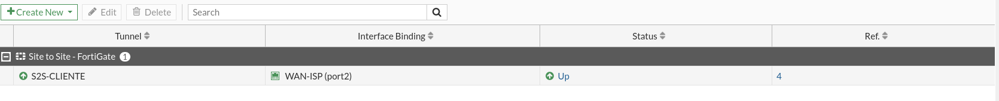

Origen: `Screenshot 2026-10-01 144548.png`.

## 7. Túnel del servidor activo

`S2S-SERVIDOR` aparece en estado `Up`, asociado a `WAN-ISP (port2)`. Se tomó en un momento distinto a la captura del cliente.

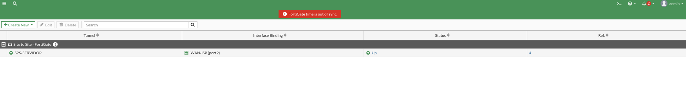

Origen: `Screenshot 2026-10-01 234328.png`.

## 8. Contadores IPsec del cliente

El monitor identifica el gateway remoto `198.51.100.22` y muestra 44.44 kB entrantes y 27.69 kB salientes. Son contadores acumulados; no identifican por sí solos una solicitud HTTPS ni una sesión SSH.

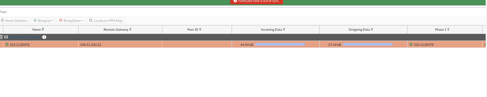

Origen: `Screenshot 2026-10-02 010636.png`.

## 9. Túnel del cliente inactivo

`S2S-CLIENTE` aparece como `Inactive`. La imagen acredita ese estado en la GUI; no muestra el ajuste administrativo `Disabled` ni el fallo de una conexión nueva al servidor. Esas comprobaciones deben acompañar la demostración final.

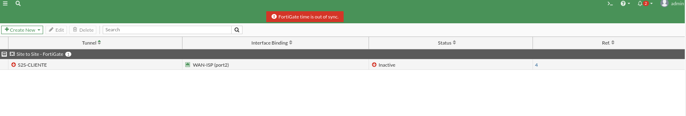

Origen: `Screenshot 2026-10-01 150117.png`.

## 10. Túnel VPN-S2S en una etapa posterior

La captura del 2 de octubre muestra un túnel `Custom` denominado `VPN-S2S`, en estado `Up` sobre `port2`. La imagen no identifica qué extremo se está consultando. Se conserva la denominación visible sin sustituir los nombres históricos en el diseño original.

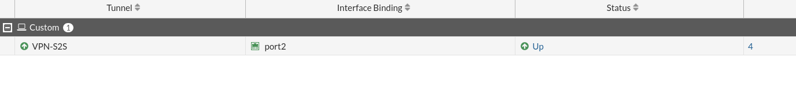

Origen: `Screenshot 2026-10-02 135716.png`.

## 11. Políticas del cliente: salida con NAT y VPN sin NAT

En `FGT-CLIENT1` se observan `LAN10-to-ISP-SNAT` hacia `port2` con NAT habilitado y las políticas `LAN10-to-VPN` / `VPN-to-LAN10` con NAT deshabilitado. Las tres permiten `ALL`. La palabra `Disabled` en estas filas pertenece a la columna **NAT**, no al estado de la política ni del túnel.

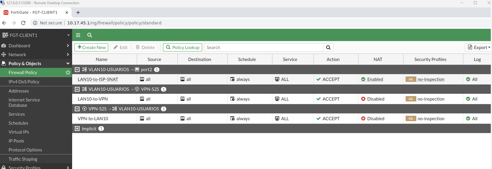

Origen: `Screenshot 2026-10-02 181108.png`.

## 12. Políticas del lado servidor en la etapa posterior

Se observan `WEB-to-ISP-SNAT` con NAT habilitado y `WEB-to-VPN` / `VPN-to-WEB` con NAT deshabilitado; los servicios son `ALL`. La regla de salida va de `port2` a `port1`, mientras que las reglas VPN vinculan `port2` con `VPN-S2S`. Esta asignación difiere del diseño del 1 de octubre, donde la LAN del servidor era `port1`; la captura por sí sola no permite actualizar todo el direccionamiento del nuevo montaje.

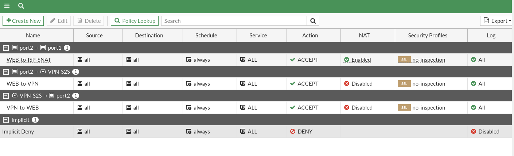

Origen: `Screenshot 2026-10-02 181732.png`.

## Evidencias pendientes

- Navegador mostrando `https://10.17.45.130` y la respuesta del servidor.
- Sesión SSH al servidor, identidad del usuario y direcciones de red.
- Concesión DHCP e IP de la PC y traceroute al servidor.
- Secuencia completa de deshabilitar VPN, comprobar conexiones nuevas fallidas y reactivar con recuperación.
- Video de demostración y confirmación de estabilidad.

Se excluyeron las capturas duplicadas o de menús sin resultados, errores de navegador/RDP, el catálogo de imágenes, el montaje con un router Linux en lugar del segundo FortiGate y una captura que expone una clave precompartida. Tampoco se incluyeron las antiguas políticas de publicación HTTPS activa como evidencia final.
